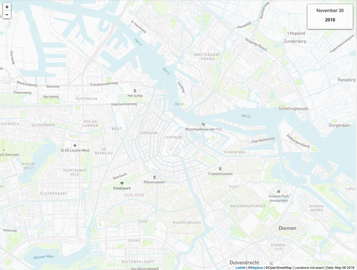

<h3 align="center">Inside AirBnB - Workflow Walkthrough</h3>

How did the Airbnb market in Amsterdam respond to the COVID-19 pandemic in terms of bookings per neighborhood?
  

## Link to the tutorial
**Check out the tutorial on [Tilburg Science Hub](https://tilburgsciencehub.com/tutorials/more-tutorials/airbnb-workflow/airbnb-workflow-overview/)**

## About The Project
[Inside Airbnb](http://insideairbnb.com/) is an independent open-source data tool developed by community activist Murray Cox who aims to shed light on how Airbnb is being used and affecting neighborhoods in large cities. The tool provides a visual overview of the amount, availability, and spread of rooms across a city, an approximation of the number of bookings and occupancy rate, and the number of listings per host.

For example, [here](http://insideairbnb.com/amsterdam/) is the dashboard for the city of Amsterdam. The animation below illustrates how the number of listings have been growing rapidly throughout the years:

## Research Question
The overarching research question that we aim to investigate is:

*How did the Airbnb market in Amsterdam respond to the COVID-19 pandemic in terms of bookings per neighborhood?*

## Methodology
To get to an answer, we need a multitude of input, transformation, and output steps. We'll use make to automate our workflows and make them reproducible. As data on Inside Airbnb is updated monthly, our program should still work once new data becomes available or if we change the city from Amsterdam to, for example, New York.

## Warning
You may need to update the URLs in *download.R* with the most recent versions of the links for the *reviews.csv* and *listings.csv* files in order for the script to function correctly.

**Check out the tutorial on [Tilburg Science Hub](https://tilburgsciencehub.com/tutorials/more-tutorials/airbnb-workflow/airbnb-workflow-overview/)**
